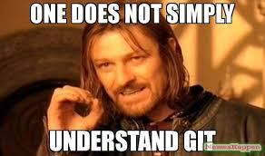

# Git internals 

  

---
> “Understanding Git internals turns Git from magic into a tool.”
---

 
## Wonderful resources I used

| Resources | Description |  
|---|---|
[Git book chapter 10](https://git-scm.com/book/en/v2/Git-Internals-Plumbing-and-Porcelain?utm_source=chatgpt.com)| Covering in depth what happening internally. 
[Git internals on youtube](https://git-scm.com/book/en/v2/Git-Internals-Plumbing-and-Porcelain?utm_source=chatgpt.com) | Best playlist explaining git internally 

## Progress / Goals 

- [ ] Finish all Oh My Git levels again (revision)
- [ ] Read Chapter 10 of the Pro Git book
- [ ] Finish Git internals YouTube playlist
- [ ] Understand why Git stores snapshots instead of diffs
- [ ] Understand blobs, trees, commits, and tags
- [ ] Explore and inspect the `.git/` directory manually
- [ ] Learn how the staging area (index) works
- [ ] Understand packfiles and object compression
- [ ] Learn how branches and HEAD work internally
- [ ] Recover mistakes using reflog and reset
- [ ] Create Git objects manually using plumbing commands
- [ ] Build a tiny Git implementation

