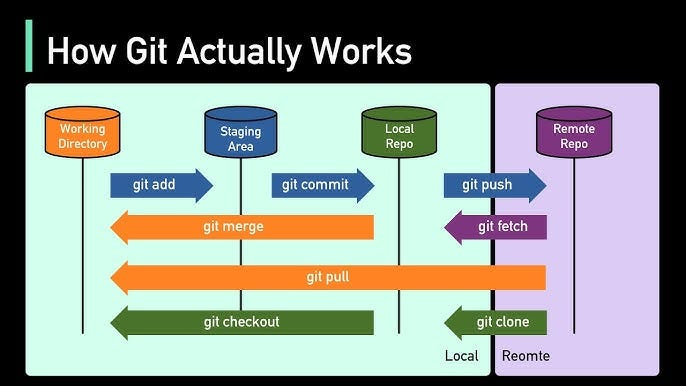

# Concepts


## 1. What is git 
* A version control.

## 2. The Four Main Areas of Git

### 1) Working Directory
Your actual files on disk.

### 2) Staging Area (Index)
A preparation area where you select changes before committing.

### 3) Local Repository
The database of commits stored on your machine.

### 4) Remote Repository
A shared repository hosted on GitHub, GitLab, etc.


---

## 3. Basic Git Flow

### `git add`
Moves changes from the working directory into the staging area.

### `git commit`
Creates a snapshot from the staged changes.

### `git push`
Uploads commits to the remote repository.

### `git fetch`
Downloads remote changes without merging.

### `git pull`
Equivalent to fetch + merge.

### `git checkout`
Switches branches or restores files.

---

## 4. The Real Core of Git

Git is not just a backup tool.

Git is actually a **content-addressed versioned graph database**: Means the address of the **objects** are known by their hashed content.

The most important concept:

> Commits form a Directed Acyclic Graph (DAG).


---

## 5. Commit Graph Example

```text
A --- B --- C main
 \
  D --- E feature
```

Each commit points to parent commits.

> Commits are snapshots to content (after staging).


- Branches are simply movable labels pointing to commits.
- So: HEAD -> Branch -> Commit 
- HEAD can point to commit as well.
- i.e HEAD, Branches just a pointers, that points to commits.

```
git add(files staged) ---> git commit ---> files are hashed & saved in .git/objects -> git stores the content along side the hash file (inside it but comporessed)
```

Ex: 
```
echo "hello" > hello.txt 
git add hello.txt 
```
To see the file hash(blob object) got to `.git/objects` -> the first 2 bytes of hash file is stored as a directory, and then the rest will be inside it as a file.
```
git cat-file -p <hash> -> a2dvdf...
```

->result: `hello`

```
Object:
{
  type: blob
  content: "hello"
}
```
> The hash is for the object itself not the file name.
```
file contents
   ↓
Git creates blob object
   ↓
Git hashes blob object
   ↓
hash becomes object ID
```
---

## 6. Understanding HEAD and Branches

HEAD points to the current branch or commit.

Example:

```text
main -> C
HEAD -> main
```

After another commit:

```text
main -> D
HEAD -> main
```

> See the branches head points to in `.git/refs/head/`
---

## 7. The Staging Area 

The staging area is not just temporary storage.

You can:

- Stage parts of files
- Stage specific hunks
- Create clean commits

Useful command:

```bash
git add -p
```

---

## 8. Intermediate Git Topics

Important topics after the basics:

- Branching and merging
- Fast-forward merges
- Merge conflicts
- Remote tracking branches
- Undoing changes
- Viewing history with graphs

---

## 9. Rebase

```bash
git rebase main
```

Rebase rewrites commit history by moving commits onto another base commit.

This creates a cleaner linear history.

---

## 10. Interactive Rebase

```bash
git rebase -i HEAD~5
```

Allows:

- Squashing commits
- Renaming commits
- Reordering commits
- Splitting commits

---

## 11. Reset Internals

Understanding reset requires understanding:

- HEAD
- Index (staging area)
- Working tree

Commands:

```bash
git reset --soft
git reset --mixed
git reset --hard
```

---

## 12. Git Internals

Git stores four major object types:

- Blob: Content of the files.
- Tree: Directories 
- Commit: 
- Tag

All objects are identified using SHA hashes.

---

## 13. Advanced Git Commands

### `git reflog`
Recover lost commits.

### `git bisect`
Find which commit introduced a bug.

### `git worktree`
Use multiple working directories.

### `git stash`
Temporarily save unfinished work.

### `git blame`
See who changed each line.

---

## 14. A Very Useful Visualization Command

```bash
git log --graph --decorate --oneline --all
```

This helps visualize the commit graph directly.


## Difference between revision and reference 

* Reference: Any pointer that points to specific git object, i.e HEAD, main , ... -> you can find this phrase in commands like : `git reflog`

* Revision: Some way to identify a specific version/object/commit -> i.e `git rev-parse HEAD`

All of these valid revisions:
```
main
HEAD
abc123
HEAD~1
main^
origin/main
v1.0
```
