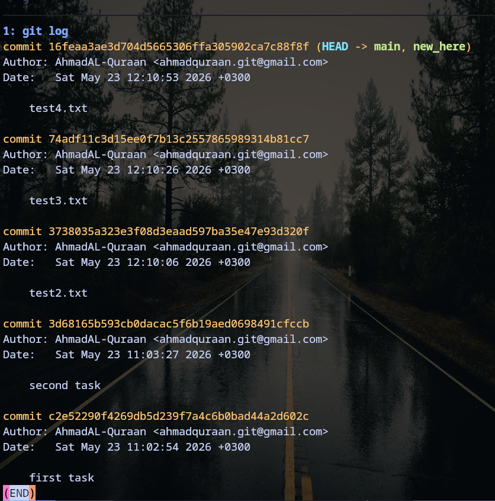

# Git archaeology

Task: Using `git cat-file` to walk from the commit object to it's tree to a blob.

* Using hash=`git rev-parse HEAD` we can have the hash of what HEAD points to which is latest commit.
* Using `git cat-file hash>` for the commit, we can see tree, parent, author, committer, and commit info for this commit.
* `Commit-> root tree -> (blob/tree)`
* Tree in this case represent the directory structure for our snapshot.


# Reflog rescue drill 

Task: Break some repo and recover it using `git reflog`

* This is the current log of our repo, we have 6 commits.



## Reset hard 
```
git reset --hard HEAD~4  #Applied this in command line.

HEAD is now at c2e5229 first task
```

* To recover it we will use `git reflog` to have all the hashes(operations/history) that we did on our references (HEAD in this case).
```
git reflog show
```


* Using `git reflog show`

- We can see that `HEAD@{0}` means our latest operation we did .
- We want to reset it to `HEAD@{1}`.
- Copy it's hash `16feaa3`.
- Use `git reset --hard 16feaa3`


* Old git log returned.


# Squash 

Task: Squash fixup commits, and reorder if needed.

`git switch -c feature/refactor-history`

