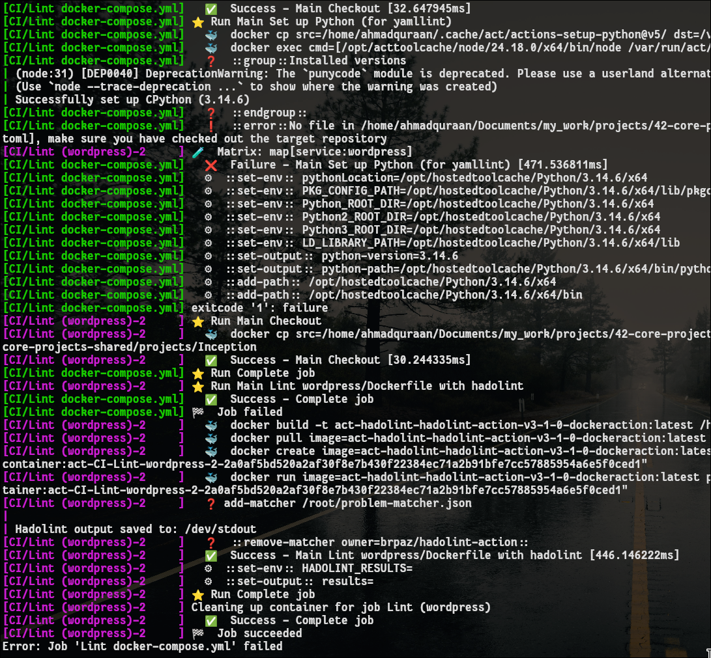

# Testing, CI/CD, and GitHub Actions

## Task1 

> Add tests where there are none. Scout for untested stuff in a GitHub repo with no. Write
a test file (or add tests to the existing test file) with well-structured Arrange/Act/Assert
tests. Submit a PR.

 - [Add integration tests for cascade detection pipeline](https://github.com/AshayK003/nse-sentiment-analyzer/pull/32): This was an interesting project. It's a Streamlit web app where you type an Indian stock ticker, it fetches the current price via yfinance, pulls recent news about that company, and uses VADER to score whether that news is bullish or bearish — all displayed together on one page.

    The cascade.py module we were just testing is a more advanced layer on top of this: instead of just scoring sentiment about the company itself, it also scans news for commodity mentions (crude oil, gold, rupee, steel, etc.) and flags which other tickers might be indirectly affected — e.g., a crude oil price surge is bad news for airline stocks like INDIGO even if INDIGO isn't mentioned by name.

    In the context of this whole app, here's what the tests I wrote actually cover:
What part of the app they test
Just one module: cascade.py, specifically the `detect_cascade()` function. This is the "commodity ripple effect" feature, separate from the main price/sentiment dashboard you just asked about.
What that feature does: when the news mentions something like crude oil, gold, or rupee movements, this function scans the text and figures out which other NSE tickers are indirectly affected — even if that ticker's name never appears in the headline. E.g., "Crude oil surges" → flags BPCL, IOC, INDIGO, ASIANPAINT as impacted, with a reason why.

| # | Test Name | What It Verifies |
|---|-----------|-------------------|
| 1 | `test_crude_oil_rise_affects_ongc` | A crude oil rally correctly flags ONGC as **Bullish** (`ticker_impact == -1`), since ONGC has an inverse relationship to crude unlike consumer-side tickers like BPCL |
| 2 | `test_detect_cascade_returns_expected_fields` | Two simultaneous macro headlines (rupee + gold) both get detected, and every field in the driver-level and per-ticker dicts matches the documented schema |
| 3 | `test_cascade_no_relevant_news` | A headline with no commodity/macro keywords returns an empty list |
| 4 | `test_cascade_empty_news_list` | Empty input doesn't error and returns `[]` |
| 5 | `test_cascade_filtered_by_focus_ticker` | With `focus_ticker="HINDALCO"` set, only the Aluminum driver (which affects HINDALCO) survives, Crude Oil is filtered out even though it also matched |

## Task2 

Build a real workflow. Take any of your existing repos and add a complete
.github/workflows/ci.yml with: lint, test, matrix on 2+ versions, caching, and a status
badge in the README

- I'm currently doing a project called ["Inception"](https://github.com/AhmadAL-Quraan/Inception) at 42, I made a github action workflow in it, so it could trigger, test and build.

Every push to main (or PR), this happens automatically:

- Lint jobs fire first (parallel, ~seconds) — hadolint checks your Dockerfiles, yamllint checks docker-compose.yml. Mostly just warnings right now.
- Test job fires after — spins up two VMs (Ubuntu 22.04 + 24.04), validates your compose file, then tries to actually build all 3 Docker images.
- I will get a ✅ or ❌ on the commit/PR in GitHub, and the README badge updates to match.

## Task3 

Run it with act. Reproduce your workflow locally with act before pushing it. Document
any differences in your journal.

* Right now it will always give fails, because I didn't yet edit the Dockerfiles, and docker-compose.yml (still empty), but I will check later on when I add more instruction to it.

