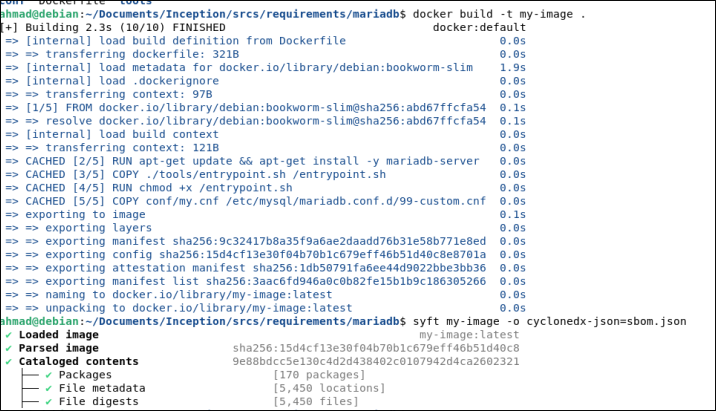
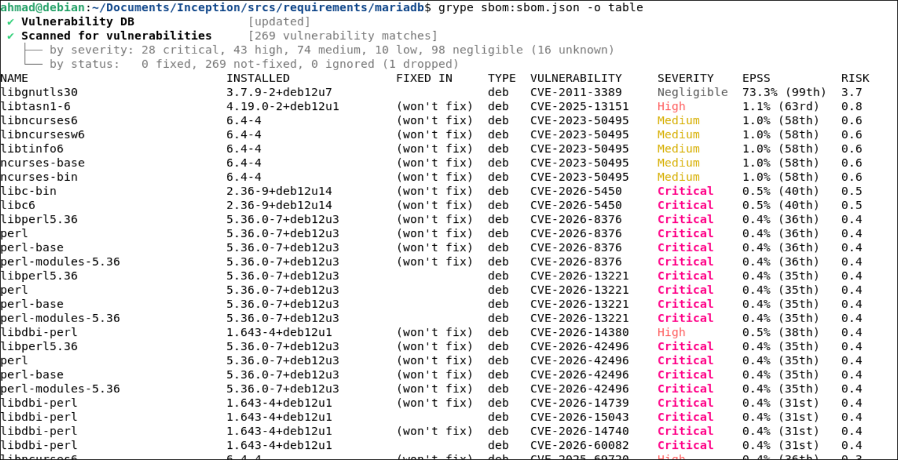

**Tools used:** Syft (SBOM generation) → Grype (vulnerability scan)  
**Target:** `my-image` — built from `srcs/requirements/mariadb/Dockerfile` (base: `debian:bookworm-slim`)




**Process:**
```bash
docker build -t my-image .
syft my-image -o cyclonedx-json=sbom.json      
grype sbom:sbom.json -o table                   
```


**Results summary:** 269 matches : 28 critical, 43 high, 74 medium, 10 low, 98 negligible. Notably, **0 have a fix available** ("0 fixed, 269 not-fixed"). Almost all of them trace back to two packages pulled in as dependencies of `mariadb-server`, not anything I added directly:

- **`perl`** (and its sub-packages: `libperl5.36`, `perl-base`, `perl-modules-5.36`) — the largest cluster of CVEs, several critical.
- **`libc6`/`libc-bin`** (glibc) — foundational to the whole OS, so any CVE here is wide-reaching.


The "won't fix" status on most entries means Debian has assessed these and decided not to backport patches to `bookworm` — often because the vulnerable code path isn't reachable in how the package is normally used, not because they're being ignored.


#### CVE picked for deeper investigation: **CVE-2026-13221**



**What it is:** A bug in Perl's regex engine (`Perl_study_chunk`), present in all Perl versions through 5.43.9. When a regex pattern contains an alternation (`|`) with more than 65,535 fixed-string branches, Perl compiles it into an internal "trie" structure for fast matching. The offset between the first branch and the shared tail is stored in a 16-bit field — with over 65,535 branches, that field overflows silently. The result: the trie's match table gets truncated with **no warning or error**, causing the regex to silently produce **wrong results** — both false positives (matching strings it shouldn't) and false negatives (missing strings it should match).

**Why it matters:** If a Perl script uses a pattern like this to gate a security decision — an access-control check, an input filter, a validation rule — the check can silently pass something it should have blocked, or block something it should have allowed. CVSS score: 9.1 (Critical), because the failure is silent and has real integrity/availability impact, even though it needs a specific unusual trigger (a huge alternation pattern) to occur.

**What's the fix:** Upstream Perl patched this in the `Perl_study_chunk` function; the fix landed in the Perl 5.43.10 development release (commit `03f74bbb...`). Debian marked it "won't fix" for `bookworm` — meaning no backport is planned for the stable release Inception's MariaDB image is built on.

**Who's affected:** Any project running Perl below 5.43.10 that constructs regex alternations from untrusted or large input sets (e.g., dynamically building a pattern from a huge word list or blocklist). For this Inception project specifically: `mariadb-server` pulls in Perl as a transitive dependency for some of its helper scripts, not because Inception's own code uses Perl. Practical exposure here is low — nothing in the Inception stack constructs attacker-influenced 65k+-branch regexes — but it's a good illustration of why "not-fixed, transitively pulled in" dependencies matter: the risk isn't in code you wrote, it's in code you inherited by picking a base image.


