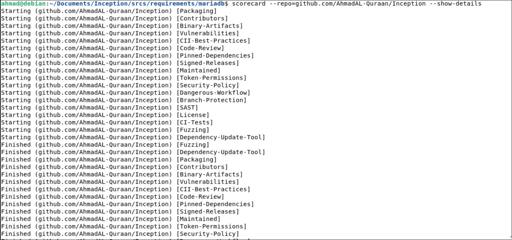
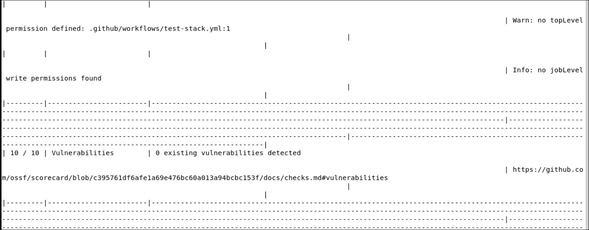

## [Task 1](https://github.com/AhmadAL-Quraan/Inception/pull/1)

* This pull request introduces `Dependabot` to automate dependency updates and improves the security of the CI workflow by pinning all GitHub Actions to immutable commit SHAs.

## [Task2](https://github.com/AhmadAL-Quraan/Inception/releases/tag/v1.0.0)

The `v1.0.0` release is signed using [cosign](https://docs.sigstore.dev/cosign/overview/)
via [Sigstore](https://sigstore.dev), automated through GitHub Actions. Signing is keyless —
identity is tied to the workflow that produced the release (`.github/workflows/release.yml`),
not a stored private key, and every signature is recorded in the public Rekor transparency log.

### Verify

Download `release.tar.gz` and `release.tar.gz.bundle` from the
[Releases page](https://github.com/AhmadAL-Quraan/Inception/releases), then:

\`\`\`bash
cosign verify-blob \
  --certificate-identity 'https://github.com/AhmadAL-Quraan/Inception/.github/workflows/release.yml@refs/tags/v1.0.0' \
  --certificate-oidc-issuer 'https://token.actions.githubusercontent.com' \
  --bundle release.tar.gz.bundle \
  release.tar.gz
\`\`\`

A successful check prints `Verified OK`, confirming the archive was produced by this
exact workflow at this exact tag and has not been modified since.

## [Task3](https://github.com/JOSA-OpenLab/AhmadAL-Quraan_progress/blob/main/week7/content/Journal%20Entry%2C%20SBOM%20%26%20Vulnerability%20Scan%20(MariaDB%20image).md)

Case study using sbom and Vulnerability scan using grype on a docker image (mariadb) in inception project.

## [Task4](https://github.com/AhmadAL-Quraan/Inception/pull/6)

* Run scorecard on Inception project.
* Found 2 main issues, the workflow `test-stack.yml` & `release.yml`
* Opened a PR to solve it by changing edit/add permissions in both workflows.

