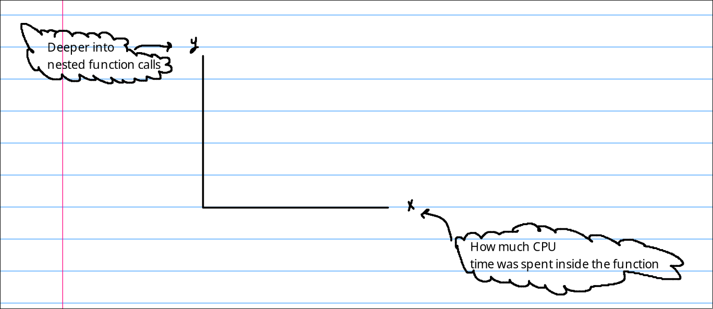
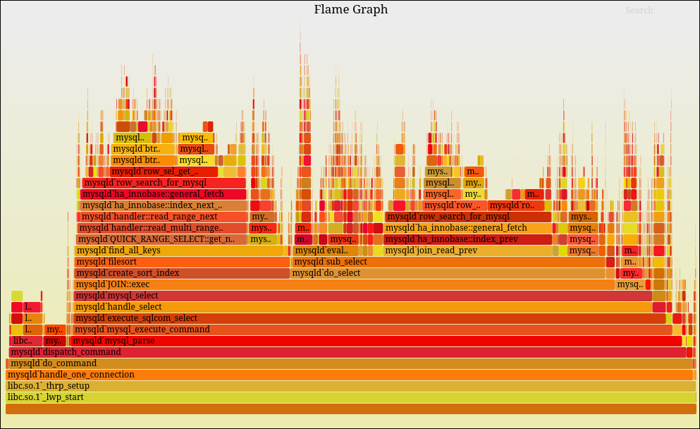

## Performance measure


1)  Always **measure** first: Run a profile before changing anything.
2) Fix what cost the most, not what look slowest.
3) Measure again and compare.


## Flame graph

Visualize where your program is spending it's time






## Tools for profiling 

* Python: [py-spy](https://github.com/benfred/py-spy) 
```
py-spy record -o profile.svg --pid 12345
# OR
py-spy record -o profile.svg -- python myprogram.py <-- Show it in Flame graph
```
* Go: [pprof](https://github.com/google/pprof)

> - Profile: Collect the measurements
> - Visualizer: Show them.


## The N+1 query

* Instead of making N+1 query to fetch data that is related (making separate query) . Ex: Posts with their writters.
* Make just one, using `join` or concept based on framework -> This called **eager loading**

> Eager loading is ==a design pattern in programming where an application fetches main data and all of its related data at the same time in one single operation==. It is the opposite of lazy loading, which waits to fetch related data until it is requested.


## USE & RED checklists

* If you want to check your code, don't just miss around trying finding something.
* Check those:
	*  USE method: For **Hardware / System resources (CPU, Memory, disk,..)**
	1)  Utilization: How busy is this cpu, mem, ...
	2) Saturation: Is work pilling up waiting for it.
	3) Errors: Is it actually failing.

	* RED method: For your own **Services/ API's** 
	1) Rate: How many requests.
	2) Errors: How many are failing.
	3) Duration: How long are requests taking.


> Watching you own api/services => RED
> Watching the machine/infra => USE
